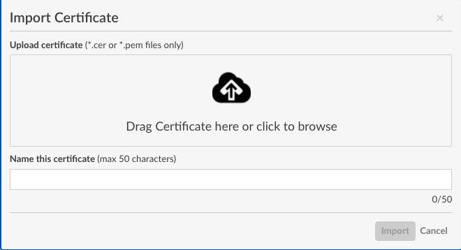

# Certificate Authentication Workflow

This pages describes the implementation of certificate-based Authentication. For the API reference of Certificate Session Authenticate and Certificate Key Manager Authenticate, see the following API endpoints:

* Session Auth: [https://developers.symphony.com/restapi/reference\#session-authenticate](https://developers.symphony.com/restapi/reference#session-authenticate)
* Key Manager Auth: [https://developers.symphony.com/restapi/reference\#key-manager-authenticate](https://developers.symphony.com/restapi/reference#key-manager-authenticate)


#### Note: The following authentication sequence is provided out of the box by our dedicated SDKs and BDK.  To learn more about authenticating using the SDKs or BDK proceed to our guide on [Authenticating using the SDKs](bot-configuration.md).


## Overview of Certificate-Based Authentication

Symphony allows you to authenticate on the Pod and Key Manager with a client certificate that is signed by a trusted root certificate. When a Bot calls the Session Authenticate endpoint, the Pod examines the client certificate provided in the TLS session to identify the Bot user and return a Session Token. The same process occurs when a Bot authenticates on the Key Manager.

All Symphony network communications take place over TLS-protected HTTP. The network uses authentication methods that require a client-authenticated TLS connection.

Client certificate authentication in TLS is configured at the port level. Two distinct ports are required for client-authenticated and non-client-authenticated connections. The web and mobile endpoints listen on port 443 \(the default port number for HTTPS connections\). The API endpoints require a separate port, typically port 8444.

## Summary

1. The user generates a certificate for bot authentication.
2. The admin uploads the certificate into the pod using the **Admin Console**.
3. The Bot makes a call the the authentication endpoints.  Here, the server client certificate provided against the "Signing Certificate" and returns an authentication token.

## 1. Generate a Certificate

Upload a copy of your Root Certificate Authorities \(CA\) Public "Signing Certificate" to the Pod. This would then permit authentication to all child certificates produced by this Signing Authority.

You can use the following commands to generate the service account certificate. **The certificate must use 4096 bits length**. The CA Cert must be imported on the POD via the Admin Console:

```text
$ openssl genrsa -aes256 -passout pass:$PASSWORD -out admin-key.pem 4096
$ openssl req -new -key admin-key.pem -passin pass:$PASSWORD -subj "/CN=$USERNAME/O=Symphony Communications LLC/OU=NOT FOR PRODUCTION USE/C=US" -out admin-req.pem 
$ openssl x509 -req -sha256 -days 2922 -in admin-req.pem -CA $CA_CERT -CAkey $CA_KEY -passin pass:$CA_PASSWORD -out admin-cert.pem -set_serial 0x1
$ openssl pkcs12 -export -out admin.p12 -aes256 -in admin-cert.pem -inkey admin-key.pem -passin pass:$PASSWORD -passout pass:$OUTPUT_PASSWORD
```

* USERNAME = Service account username 
* PASSWORD = Service account key password 
* CA\_CERT = CA certificate file 
* CA\_KEY = CA key file 
* CA\_PASSWORD = CA key password 
* OUTPUT\_PASSWORD = PKCS12 file password

### Creating a Certificate Signing Request \(CSR\):

The following table shows the information you will need to provide to your PKI team:


The Common Name \(CN\) value must match the name of the Symphony Service Account you created, this should also use the same case value.


| Details | Example Values |
| :--- | :--- |
| Certificate Type | Sigle Domain Certificate |
| Common Name \(CN\) | demo-bot1 |
| Organization | Excelsior Bank |
| Department | Collaboration Services |
| Email | admin@bots.symphony.com |
| Locality | London |
| State / Province | London |
| Country | GB |
| Key Size | 2048 bits |

## 2.  Upload your Certificate

Once you have received your signed certificate, you will need to upload your public certificate to the Symphony Pod.


The certificate should be concerted to a CER or PEM format before it is uploaded


If you have obtained a copy of your Root Certificate Authorities \(CA\) Public "Signing Certificate", you can upload it using the following steps:

1. Navigate to the Symphony Admin Console for your Pod \(e.g. [https://mypod.symphony.com/?admin](https://mypod.symphony.com/?admin)\), then log in with your credentials
2. Once logged in click the _Manage Certificates_ button then select _Import_
3. Drag and drop your Certificate file into the popup window:



1. Once you have uploaded the certificate file, click _Import._  If successful you will receive a confirmation message saying that the certificate has been uploaded successfully.

## 3. Authenticate

To authenticate on the Pod the Bot must call the Session Auth endpoint: [https://developers.symphony.com/restapi/reference\#session-authenticate](https://developers.symphony.com/restapi/reference#session-authenticate). Pass along the client certificate provided in the TLS session, returning a Session Token:

```bash
$ curl --cert bot.user1.p12:mypassword 
https://${symphony.url}/sessionauth/v1/authenticate 
-X POST
```

A successful response:



```bash
{
  "name":"sessionToken",  
  "token":"SESSION_TOKEN"
}
```



To authenticate on the Key Manager, the Bot must call the Key Manager Auth endpoint: [https://developers.symphony.com/restapi/reference\#key-manager-authenticate](https://developers.symphony.com/restapi/reference#key-manager-authenticate). Pass along the client certificate provided in the TLS session, returning a Key Manager Token:

```bash
$ curl --cert bot.user1.p12:mypassword 
https://${symphony.url}/keyauth/v1/authenticate 
-X POST
```

A successful response:



```bash
{
  "name":"keyManagerToken",
  "token":"KEY_MANAGER_TOKEN"
}
```



Pass the Session Token and Key Manager Token as headers for all subsequent API requests.


