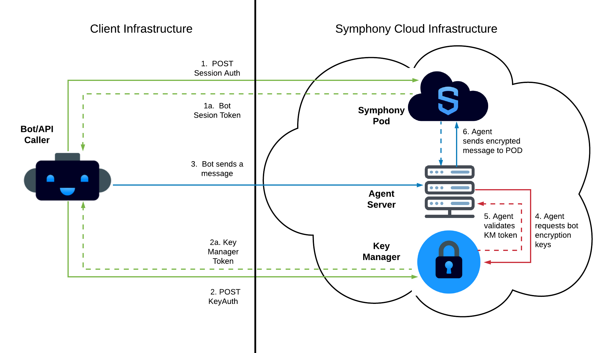
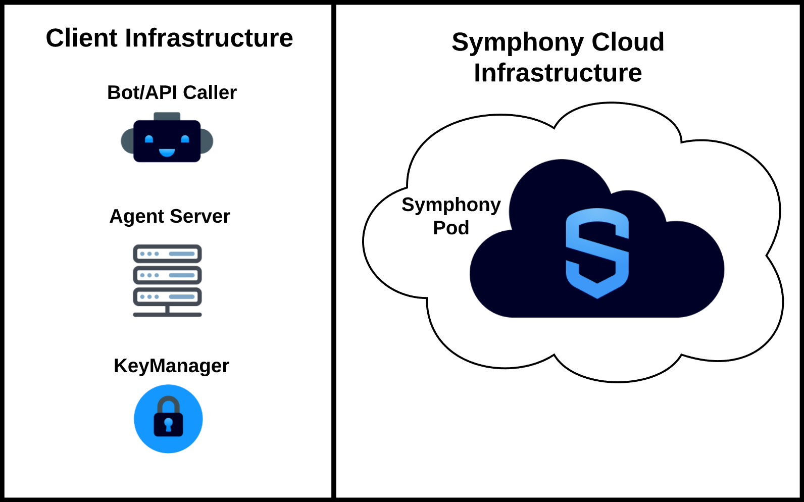

# REST API Architecture

Symphony's REST API is spread out over three main components: the **Symphony Pod**, **API Agent** and **Key Manager**. Let's take a closer look at these components below.

## Symphony Pod  

The Symphony Pod is a dedicated Symphony instance for each customer environment. It is a cloud-hosted component that handles all core operations necessary to provide the Symphony service to you. Since Symphony provides end-to-end encrypted messaging, all messages passed from user to user are fully encrypted at the time of sending, such that no Pod ever has access to the unencrypted contents of any message.

In addition, the Symphony Pod provides REST API endpoints in order for your bot to perform administrative functions on the Pod. You can read more about the Pod API here:



## API Agent

The API Agent is the Symphony component responsible for encrypting and decrypting content sent from and to a bot. The Agent provides REST API endpoints that allow a bot to send and receive encrypted messages, acting as the intermediary between a bot and the Symphony Pod. In order to safely encrypt and decrypt these messages, the Agent server interacts the Key Manager which provides the keys used for encrypting and decrypting messages.

Read more about the Agent API here:



## Key Manager

The Key Manager generates and stores encryption keys which are used to encrypt and decrypt messages by the Agent Server. The Key Manager provides an authentication API that provides a unique Key Manager Token to a calling bot. This token is used to encrypt/decrypt messages on the Agent Server.

Read more about the Key Manager API here:



## Interacting with the Components

The three components above all interact with each other in order to create Symphony's secure messaging service. Let's take a closer look at the sequence of API calls a bot must make in order to send and receive encrypted messages on Symphony.

1. First, a bot must authenticate with the Pod. It does so by calling the [Session Authenticate endpoint](https://developers.symphony.com/restapi/reference#rsa-session-authenticate).  If successful, the bot will receive a valid Session Token. This Session Token must be passed along with all subsequent Symphony API requests destined for the Agent or the Pod.
2. Next, a bot must authenticate with the Key Manager. It does so by calling the [Key Manager Authenticate endpoint](https://developers.symphony.com/restapi/reference#key-manager-authenticate). If successful, the bot will receive a valid Key Manager Token. This Key Manager Token must be passed along with all subsequent Symphony API requests destined just for the Agent.
3. If the bot wants to send a message, the bot will call the [Create Message endpoint](https://developers.symphony.com/restapi/reference#create-message-v4) on the Agent API and pass both Session Token and Key Manager Token as a part of the request.
4. At this point, the Agent Server calls the Key Manager and requests the bot's encryption keys.  
5. Next, the Agent Server validates the bot's Key Manager Token.
6. If successful, the Agent will encrypt the payload sent by the bot and will forward the encrypted message up to the Pod where it will be routed to the intended user or chatroom.  The message will remain encrypted until it reaches its final destination.

The sequence of API calls and component interaction is illustrated below:

For an even more detailed explanation, enroll in our Developer Certification Program:


Navigate to [Overview of Datafeed](rest-api-architecture.md) to learn more about how bots process messages and other real time events


## On-Premise Deployment

For our enterprise customers, the API Agent and Key Manager components are deployed on-premise, while the Pod is always deployed in the cloud. Your bot or REST API caller is an application that **must be deployed on-premise** in this scenario.

An visual representation showing an on-premise deployment of Symphony components is shown below:

## In-Cloud Deployment

For our smaller customers, the API Agent and Key Manager may be co-hosted with the Pod in the cloud. Your bot or REST API caller can either be **deployed on-premise** or **in your own cloud environment**.

A visual representation showing an in-cloud deployment of Symphony components is shown below:

