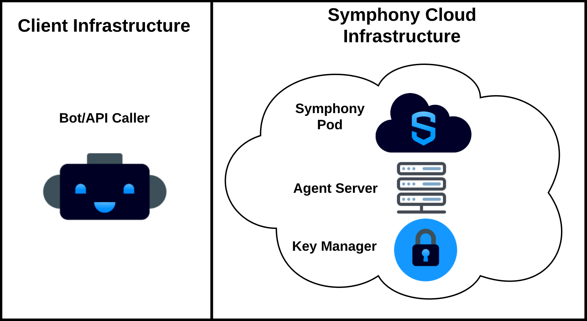

# REST API Architecture

As stated before, Symphony's REST API is spread out over Symphony's three main components: the Pod, Agent server, and Key Manager. Let's take a closer look at these components below: 

## Symphony Pod

The Symphony Pod is your dedicated Symphony instance.  The Symphony Pod is a cloud hosted component that handles all administrative functions as well as passing encrypted messages from user to user.  Since Symphony provides end-to-end encrypted messaging, all messages passed from user to user are fully encrypted from the time of sending, so that the Symphony Pod never has access to the contents of messages being sent.  

In addition, the Symphony Pod provides REST API endpoints in order for your Bot to  authenticate itself on the Symphony Pod.  You can read more about the Pod API here:



## Agent Server

The Agent Server is the Symphony component responsible for encrypting and decrypting payloads of messages and files sent from a Bot.  The Agent server provides REST API endpoints that allow a bot to send and receive encrypted messages, acting as the intermediary between a Bot and the Symphony Pod.  In order to safely encrypt and decrypt these messages, the Agent server interacts the Key Manager which provides encryption keys for encrypting messages.

Read more about the Agent API here:



## Key Manager

The Key Manager generates and stores encryption keys which are used to encrypt and decrypt messages by the Agent Server.  The Key Manager provides an authentication API that provides a unique Key Manager Token to a calling Bot.  This token is used to encrypt/decrypt messages on the Agent Server.

Read more about the Key Manager API here:



## Putting It All Together

The above three components all interact with each other in order to create Symphony's secure messaging service.  Let's take a closer look at the sequence of API calls a Bot must make in order to send and receive encrypted messages on Symphony.

1. First a Bot must authenticate on the Pod.  It does so by calling the Session Auth endpoint found here: [https://developers.symphony.com/restapi/reference\#rsa-session-authenticate](https://developers.symphony.com/restapi/reference#rsa-session-authenticate).  If successful, the Bot will receive a valid Session Token.  This Session Token must be passed along with all subsequent Symphony API requests destined for the Agent or the Pod.  
2. Next, a Bot must authenticate on the Key Manager.  It does so by calling the Key Manager Auth endpoint found here: [https://developers.symphony.com/restapi/reference\#key-manager-authenticate](https://developers.symphony.com/restapi/reference#key-manager-authenticate).  If successful, the Bot will receive a valid Key Manager Token.  This Key Manager Token must be passed along with all subsequent Symphony API requests destined just for the Agent.   
3. If a Bot is conversational or interactive,  the next step is to create a Datafeed by calling the Agent API.  You can learn more about the different types of Bots here: [Different Types of Bots](../planning-your-bot/different-types-of-bots.md).  The Datafeed provides an encrypted stream of all Symphony events within the bot's scope.  You can read more about Symphony Datafeeds here: [Overview of Datafeed](../datafeed/overview-of-datafeed.md).
4. In order to create a Datafeed, Bots must make an API call to the following Agent endpoint: [https://developers.symphony.com/restapi/reference\#create-messagesevents-stream-v4](https://developers.symphony.com/restapi/reference#create-messagesevents-stream-v4).  Since, this API endpoint exists on the Agent server, the Bot will pass both its Session Token and Key Manager token as apart of its request.
5.  At this point, the Agent server calls the Key Manager and requests the Bot's encryption keys.  After the Key Manager returns the Bot's encryption keys, the Agent confirms the Key Manager token sent and Bot encryption keys are valid and proceeds to create the Datafeed.  
6. If, for example, a Bot wants to send a message, the Bot will call the following Agent API endpoint: [https://developers.symphony.com/restapi/reference\#create-message-v4](https://developers.symphony.com/restapi/reference#create-message-v4) and pass both its Session Token and Key Manager Token as a part of the request.  The sequence presented in Step 5 will take place, and the Agent will encrypt the payload/message sent by the Bot.  Next the Agent will forward the encrypted message up to the Pod where it will be routed to its appropriate IM or chatroom.  The message will remain encrypted until it reaches its destination.     

## On-Premise Deployment

For our larger customers, the Agent server and Key Manager components are deployed on premise, whereas the Pod is always deployed in the cloud.  Your Bot or REST API caller, is an application that can be deployed on-premise or in the cloud.  

An visual representation showing an on-premise deployment of Symphony components is shown below:  

## In-Cloud Deployment

For some of our smaller customers, the Agent server and Key Manager may be deployed alongside the Pod in the cloud.  Your Bot or REST API caller, is an application that can be deployed on-premise or in the cloud.

A visual representation showing an in-cloud deployment of Symphony components is shown below:    

## Interacting with the Components:

Symphony Bots can interface with each of these three components via the REST API.  Symphony's REST API is spread out across these three components.  

