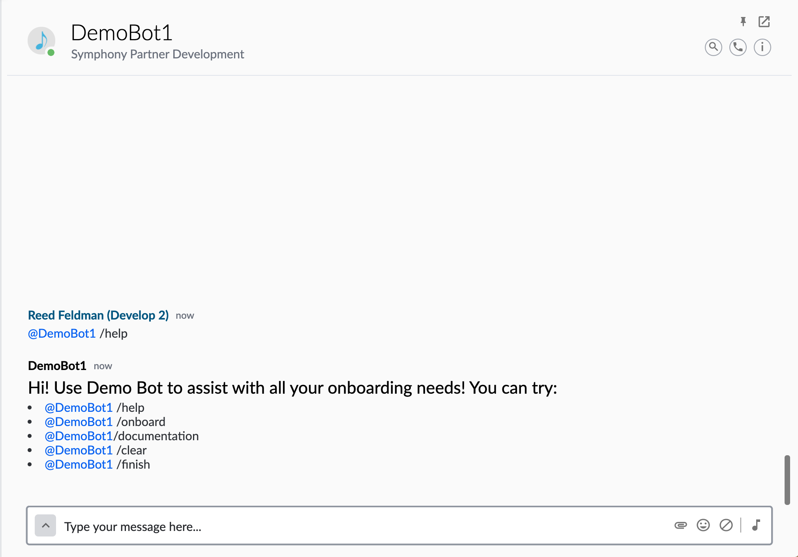

# Chatbot

Chatbots or conversational Bots, are the most common Bots in the Symphony ecosystem. These types of bots run 24/7 and wait for users to initiate conversations in order to perform certain actions. The conversations could be simple commands or even natural language queries. The bot will determine the user’s intent based on their messages and take the appropriate action.

## Chatbot Workflow

## 1.  Kick off your Workflow

As stated before, users can interact with chatbots in chatrooms, MIMs and IMs. In order to initiate your chatbot's workflow we recommend that users @mention the Bot's username in order to get the Bot's attention and signal to the Bot to begin its intended function. That way, chatbots can be active members of chatrooms or MIMs, but eliminate noise that is outside the scope of its intended workflow.

It is common for Bots to contain multiple commands or sub workflows that it can action upon. It is best practice to list these commands in a help menu. Additionally, it is best practice for all commands to follow a "/" so that its clear what text is meant to be processed as a command. the following illustrates these best practices:

## 2.  Listen for Events

A core aspect of all chatbots and conversational Bots is the ability to 'listen' to different types of commands and events and reply to them accordingly. The mechanism that enables Symphony Bots to listen to events in chatrooms, MIMs, and IMs is the **Symphony Datafeed**.

The **Symphony Datafeed** is a real-time message and event stream that can be created using the REST API. The datafeed provides a secure stream of messages and events from all conversations that a Bot is in.

In order to 'listen' and respond to user events, Bots need to create a single datafeed and will subsequently have access to all chatroom activity including non-chat based events such as users being added/removed from chatrooms, external connection requested, chatrooms, MIMs, IMs being created and many more.

To learn more about the Symphony Datafeed continue here:



## 3.  Handle Events with Custom Business Logic

The next step of your chatbot workflow is to introduce your custom business logic. Once you have access to the Bot's events and messages through the Symphony Datafeed, the next step is to create dedicated event listeners. Inside these listeners is where you parse messages, fetch data from external sources, manage conversation state, and make requests to Symphony's REST API in order to reply to users directly or performs administrative functions such as creating chatrooms.

You can learn more about parsing events and introducing custom business logic here:



## Next Steps:

Continue on to our tutorial on building chatbots. Here you will learn how to get your own chatbot up and running and take a closer at the APIs used to create a simple chatbot workflow:

